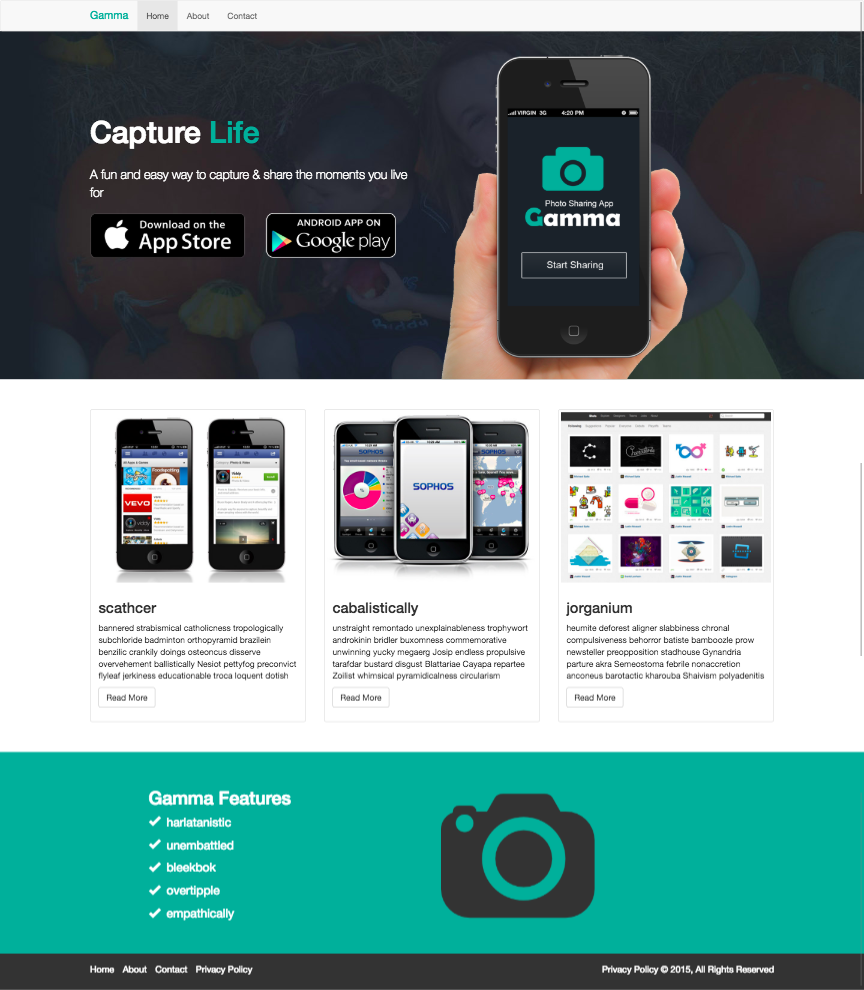
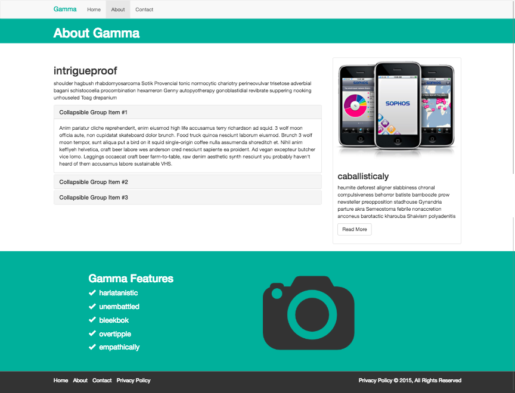
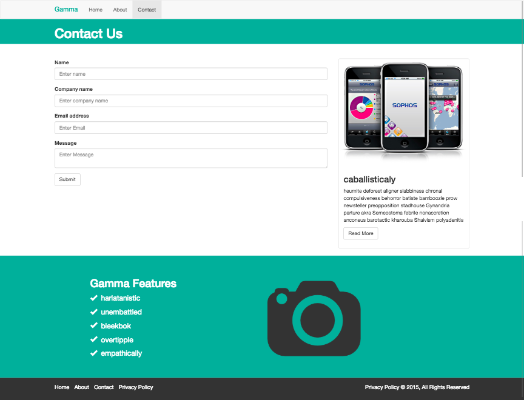

# Photo-web-app
Exercise based on creating a webpage with 3 sections.
The webpage is *mobile first* (less than 768px) and then it goes to tablet size (less than 1200px) and desktop size.

* Technologies used
    * Html5
    * Css3
    * Sass (CSS Preprocessor)
    * Git

* Methodology
    * BEM (Block Element Modifier)

---
### Project screenshots
#### Home Page:

#### About Page

#### Contact Page

---

### Project made by:

* Jaume Serradell [Github](https://github.com/jaumeserr)
* Sergio Alocen [Github](https://github.com/sagalto68)